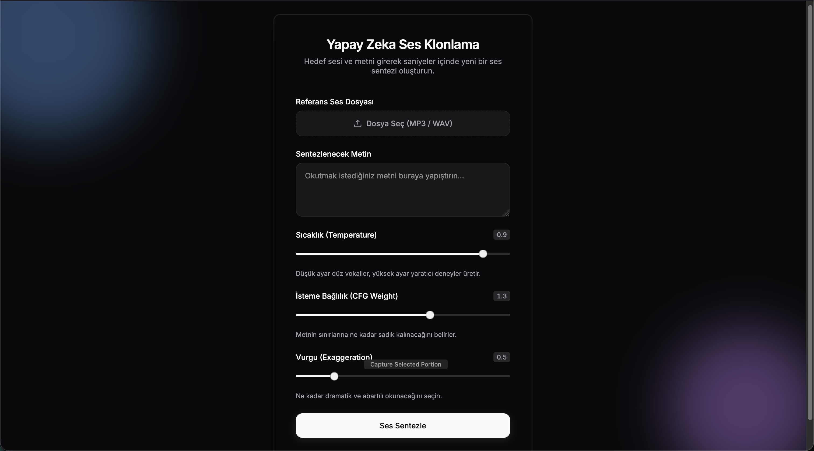

# AI Ses Klonlama



Modern, profesyonel bir arayüze sahip olan, FastAPI ve `chatterbox` modeli tabanlı Yapay Zeka Ses Klonlama ve Metin-Okuma (Text-to-Speech) aracı.

## Özellikler

- **Gelişmiş Premium Arayüz:** Vanilla CSS ve HTML kullanılarak hiçbir dış kütüphaneye bağımlı kalmadan "MagicUI / Shadcn" gibi premium tasarım kütüphaneleri mimarisinde (karanlık tema, animasyonlu sıvı arkaplan, şeffaf cam efektleri) geliştirilmiştir.
- **Asenkron Ses Sentezleme & Polling:** Uzun süren AI model inferans/sentez işlemleri doğrudan arka planda (Background Tasks) işlenir. Arayüz her 3 saniyede bir durumu sorgular.
- **İnce Ayar Parametreleri:** 
  - **Sıcaklık (Temperature):** Yüksek oldukça yaratıcılık ve duygusal çeşitlilik artar, düşük oldukça durağanlaşır (Varsayılan Chatterbox değeri: 0.8).
  - **İsteme Bağlılık (CFG Weight):** Verilen metin/ses şablonuna sıkı sıkıya uyma eğilimini etkiler (Varsayılan: 0.5).
  - **Vurgu (Exaggeration):** Robotik okumadan ziyade dramatik, heyecanlı ve nefes kesici bir okuma ekler (Varsayılan: 0.5).

## Kurulum

1. Depoyu klonlayın veya indirin.
2. Terminalinizi proje dizininde açın.
3. Python sanal ortamınızı (Virtual Environment) aktif edin:
   ```bash
   source venv/bin/activate
   ```
   *(Eğer kurulu değilse öncesinde `python3 -m venv venv` ile oluşturabilirsiniz.)*
4. Gerekli kütüphaneleri yükleyin:
   ```bash
   pip install -r requirements.txt
   ```
   *(Not: Projenin çekirdeği olan `torch`, `torchaudio`, `fastapi`, `uvicorn`, `python-multipart` ve özelleştirilmiş `chatterbox` modüllerinin tam olduğundan emin olun.)*

## Kullanım

Sistemi/Servisi yerel (localhost) ortamda ayaklandırmak için şu komutu çalıştırın:

```bash
uvicorn server:app --reload
```

Sunucu başarıyla başladığında (MPS/CPU üzerinde model initialize edilmesi birkaç saniye sürebilir), tarayıcınızdan **http://127.0.0.1:8000** adresine gidebilirsiniz.

## Proje Yapısı
- `server.py`: FastAPI backend kodlarını, model entegrasyonlarını, arkaplan görev yürütücü modülünü ve API endpointlerini barındırır.
- `index.html`: Tamamen özelleştirilmiş, JS asenkron requestleriyle desteklenmiş Web UI dosyasıdır.

## Örnekler
Modelin okuma başarısını ve tonlamasını incelemek için dizindeki test çıktılarını dinleyebilirsiniz:
- **Orijinal Ses:** [benim-ses.wav](benim-ses.mp3) (Sentezde kullanılan referans kaynak ses)
- **Klonlanan Ses:** [klon-ses.wav](klon-ses.mp3) (Yapay zeka tarafından oluşturulan son çıktı)
